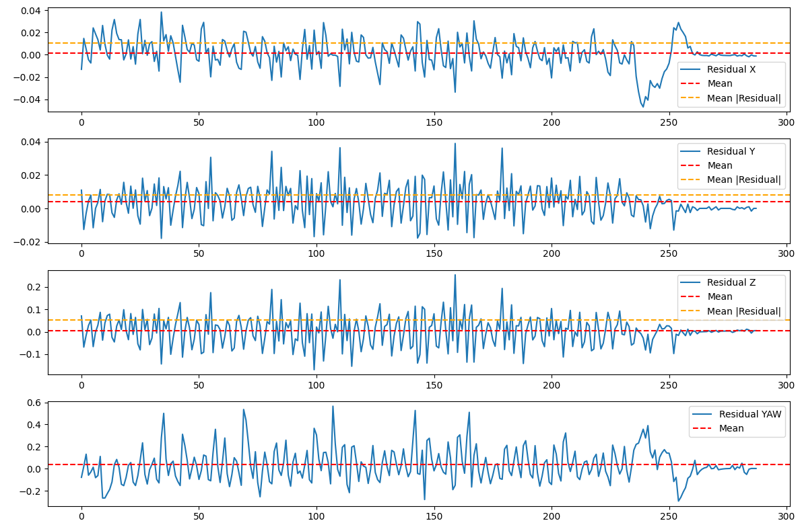

## 视频信息：
test目录下有两个视频文件夹,一个是用于平动预测的linear_video,另一个是用于旋转预测的circular_video,其具体内容如下。
linear_video:
    视频一: linear_easy.avi
        视频来源: 同济大学 SuperPower-2025培训课程
        视频信息: fps:30  img:1280*1024
    视频一: linear_difficult.avi
        视频来源: 国防科技大学开源测试视频 url:https://github.com/djfijj/ArmorPredict/blob/master/Project1/live.avi
        视频信息: fps:10  img:1280*1024

circular_video:
    视频一: circular_easy.avi
        视频来源: 同济大学 SuperPower-2025培训课程
        视频信息: fps:30  img:1280*1024
    视频一: circular_normal.avi
        视频来源: 哔哩哔哩 BV1A341137UR
        视频信息: fps:23  img:1080*720
    视频一: circular_difficult.avi
        视频来源: 群文件视频
        视频信息: fps:30  img:1846*1080

## 测试需求
------------------------------------------------------
任务一要求:
    要求test内任意两个视频能够得到稳定识别结果：
    要求所有帧识别成功率(success_frame/sum_frames)>=80%
    数字识别准确率>=80%
    位置信息可视化显示即可
------------------------------------------------------
任务二、三要求:
测试方案：计算预测结果与实际结果之间位置信息（x,y,z）的差值（绝对值平均值,xyz分开计算）
测试要求：
    linear_easy: 要求xyz三轴的绝对值平均值<= 3cm
    linear_difficult: 要求xyz三轴的绝对值平均值<= 5cm
    ------------------------------------------------
    circular_easy: 要求xyz三轴的绝对值平均值<= 3cm
    circular_normal: 要求xyz三轴的绝对值平均值<= 5cm
    circular_difficult: 要求xyz三轴的绝对值平均值<= 7cm (选做)
测试效果参考：

